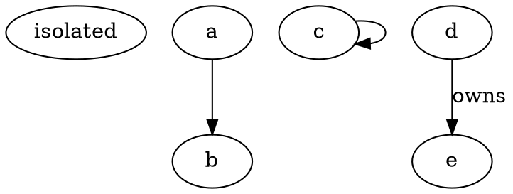

# Geiger script review and Go/Rust port assessment — 2026-09-27

**Recommendation: hybrid, retaining the Python core.** Fix extraction, coverage reporting, Git history bounds, and two algorithmic performance defects. Replace Dart's line regex with an ast-grep/tree-sitter adapter (already installed here) or Dart analyzer adapter. Do not port the entire tool to Go or Rust now. On the profiled large repository, Git subprocesses consumed **94.36%** of elapsed time: eliminating all other work would improve that run only **1.060×**. Python fixes outperform changing implementation language as the first intervention.

## Scope and reproducibility

Read all 1,119 lines of `~/.config/agents/skills/geiger/scripts/xray.py`, all 93 lines of `dart_edges.py`, the complete skill invocation/output contract, and the Go/Rust/Python tooling contexts. No delegation; no source skill modifications. All fixtures, script copies, prototypes and raw measurements are in `/tmp/geiger-review/`.

Source SHA-256:

- xray.py: `98f2ef09c1a74e5088ac2978b7fcaec0b20d9accb1673f54559d489c9f9a8156`
- dart_edges.py: `ee4dc9508d3289ad9150ced1d3d20cf3230a9f798324c54dfb13a16c6f7209c3`

Machine: Linux x86_64, CPython 3.13.14 launched through `uv run --no-project`, Go 1.26.7, Rust 1.99.0-nightly, ast-grep 0.45.1. Bench harnesses use the interpreter selected by uv (`sys.executable`) for repeated subprocesses, avoiding repeated uv overhead. GNU time records wall/user/system seconds and max RSS KiB. Caches were not dropped. This is a shared, variably loaded machine: wall times vary substantially, and some separate experiments overlapped. These are observed ranges, not isolated CPU benchmarks or general language rankings.

Real-repository discovery used `fd -t d -d 2 . ~/repos`. The scripts were copied to scratch and executed against the real working trees, without edits to those repositories.

## Measured runs

Three successive runs per real-repository mode, default `--top 10`:

| Repository | Tracked files | HEAD | No Git, seconds | With Git, seconds | Extracted graph |
|---|---:|---|---|---|---|
| dedoc-contrib | 17 | `5d2e0b6bc23d` | 0.479 / 0.363 / 0.199 | 0.192 / 0.352 / 0.661 | 8 nodes, 14 edges |
| whats-up-doc | 62 | `3a2a0b0975ab` | 0.387 / 0.251 / 0.214 | 0.659 / 0.483 / 0.306 | Git-only, no graph |
| kakoune | 2,630 | `f8bd8cbccdd3` | 0.074 / 0.072 / 0.074 | 0.201 / 0.234 / 0.180 | Only 2 Python nodes, 0 edges; C++ omitted |
| nixpkgs | **54,170** | `d2f679497988` | **0.593 / 0.713 / 1.137** | **39.059 / 20.055 / 11.116** | **239 Python nodes, 129 edges**, not the whole Nix repository |

Nixpkgs has **1,064,138 reachable commits**. Its digest analyzes only **5 qualifying non-bot, recognized-code commits** from the last 2,000 non-merge commits. The cap is on raw history, before language/bot filtering, not 2,000 relevant commits. Other runs report 2, 35 and 3 qualifying commits respectively. Kakoune's local clone has only 12 reachable commits. These coverage limits matter more than the apparently small graphs.

Nixpkgs full-run maximum RSS was **1,403,272 / 1,847,140 / 1,847,132 KiB** (about 1.34–1.76 GiB); no-Git was about 35–36 MiB. An individually timed Git hotspot query reproduced **1,846,820 KiB** RSS and **28.18 s wall / 9.34 s user / 0.63 s system**. Thus the large RSS is demonstrably in Git, not evidence of a Python heap problem.

A subsequent instrumented warm nixpkgs run took **10.227 s**:

- `git log --numstat -M --max-count=2000`: **2.901 s**, 2.97 MB stdout.
- One file-specific `git log -p --max-count=300`, for `systemd-boot-builder.py`: **6.374 s**, only 381 KB stdout.
- All Git calls combined: **9.649 s (94.36%)**.
- Everything else, including Python extraction and metrics: **0.577 s**.

The expensive file query can walk a million-commit history to find up to 300 changes. Its 20-second timeout also makes `hot_functions` nondeterministic: the initial full run produced a smaller digest than subsequent runs. A port that invokes the same Git commands retains this cost.

Dart on the only real `.dart` source found under these repositories (nixpkgs): **0.59 s**, 1 node, 0 local edges, 0 workspace packages; the generated JSON also passed through xray. This is a real CLI smoke test, **not** a representative Flutter benchmark. Dart correctness coverage comes from scratch fixtures.

A separate synthetic 10,000-file Python chain exercised actual file discovery, AST extraction, SCC and digest generation: **3.607 / 3.721 / 3.117 s wall**, approximately **1.10–1.16 s user + 0.20–0.21 s system**, ~30 MiB RSS; 10,000 nodes and 9,999 edges. NCCD, propagation cost and levelization are **skipped** at this size. A graph-only 10,000-node chain took 0.035 s with the same skips. Do not present either as a complete 10k-node metric benchmark.

Raw evidence: `bench.py`, `bench.json`, per-run JSON files, `profile_run.py`, `profile.json`, `large_python.py`, `large_python.txt` in scratch.

## Ranked findings with reproductions

Line references below are to the original files identified by the hashes above. P1 means fix before trusting general audits; P2 means material accuracy/robustness defect; P3 means contract or diagnostic weakness.

### P1 — Closure frontier grows exponentially on a small layered DAG

**xray.py:361–362.** The comprehension tests against the old `seen` set, then updates it after the whole frontier. Multiple parents enqueue the same child repeatedly; those duplicates multiply on subsequent layers. The comment claiming O(V×E) does not hold for this implementation.

Repro: 10 layers of width 6, each vertex pointing to every vertex of the next layer. Only **60 nodes and 324 edges**. Original closure: **9.991 s**, peak frontier **10,077,696 entries**, CCD **1,680**. Marking each node seen *when enqueued*: **0.000752 s**, peak frontier **6**, same CCD. Width 6 × 11 layers (**66 nodes, 360 edges**) raised `MemoryError` under a 512 MiB address-space cap after **24.65 s**. The 3,000-node guard does not protect against this.

Reproduce: `uv run --no-project /tmp/geiger-review/closure.py original 6 10` and `... fixed 6 10`; use `original 6 11` for the bounded-memory failure. The harness reproduces the exact closure loop, without unrelated graph phases. Fix the enqueue invariant; then consider SCC-condensation bitsets.

### P1 — External graph inputs ignore default test/generated exclusions

**xray.py:175–201, 825–828.** `align_to_git` filters the *matching universe* but preserves every original node and edge. It never filters the graph itself, despite the source/skill claim that defaults exclude tests/generated code from graph and Git signals.

Repro adjacency: `{"a.py":["tests/t.py"],"tests/t.py":["a.py"]}` with both files present, `--edges edges.json --no-git`. Default output is **2 nodes, 2 edges, one cycle**, identical in substance to including tests; expected default production graph has one node and no cycle. The lowered join rate does not correct contaminated cycle/hub/SDP metrics. Filter both source and target nodes before scope and metrics, after path normalization. The same defect affects Dart, madge and dependency-cruiser inputs.

### P1 — Python resolver both fabricates dependencies and misses initialization cycles

**xray.py:93–100, 112–126.** Every unique dotted suffix becomes an importable module, without actual source roots. Root `main.py` containing `import local`, alongside only `pkg/local.py`, produces a false `main.py → pkg/local.py` edge. Under normal root `sys.path`, that import does not resolve to this file. Multiple source roots also lose valid short-name imports when suffixes collide. Dropping stdlib-colliding names is conservative but also drops valid local shadowing.

The other direction is missed: `main.py: import pkg.a`; `pkg/__init__.py: import main`; empty `pkg/a.py`. Output contains `main → pkg/a` and `pkg/__init__ → main`, **but omits `main → pkg/__init__`**, hiding the actual initialization dependency cycle. `import pkg.sub.mod` similarly omits parent initializers. `from pkg import a` has different behavior because it explicitly adds both names.

Repro: `repro.py` prints the extracted Python graph; `RELATIVE_CONTROL` in `more_repro.py` verifies ordinary relative imports still resolve. Keep `ast`, add explicit source-root/module identities and a documented initializer policy. A tree-sitter or language port alone does not solve name resolution.

### P1 — Dart line parsing loses legal directives and invents imports from strings

**dart_edges.py:20–24, 71–78.** `import\n 'b.dart';` is missed; `import 'c.dart'\n if (dart.library.io) 'd.dart';` retains `c` but loses `d`. An apparent `import 'fake.dart';` inside a multiline string is counted. Regex comment removal has no lexical awareness, including nested Dart block comments and comment markers inside strings. Two directives on one line are also not both processed. `part` relationships are absent (line 20): if nodes mean files, parts are false orphans; if nodes mean libraries, parts should be collapsed into their owner, not emitted as independent nodes.

Scratch fixture `fixtures/dart/lib/a.dart` combines the first three cases and a part directive. Output is **only `c.dart` and the false `fake.dart`**; it loses `b.dart`, `d.dart`, and the part relationship. These are extraction errors before graph analysis.

A positive replacement control used installed **ast-grep 0.45.1**:

```sh
ast-grep run --lang dart --kind import_or_export --json=compact /tmp/geiger-review/dart-valid.dart
```

It returned **both complete real directives**, including the wrapped conditional, and **no string-literal fake import**. Seven runs: **4.27–5.67 ms**, median **5.26 ms**. This proves syntax recognition on the fixture, not package resolution or grammar completeness. URI extraction should use child syntax nodes and retain conditional-edge metadata; do not reintroduce whole-file regex parsing behind this adapter.

### P2 — Levelization repeatedly copies the entire remaining-node set

**xray.py:340–342.** `succ[x] & remaining - {x}` parses as `succ[x] & (remaining - {x})`; similarly for predecessors. It copies a potentially large set for every candidate in repeated scans. A chain can approach cubic set-copy work rather than efficient degree peeling.

Repro, 1,000-node chain: full metrics **3.806 s** original vs **0.278 s** after changing just these expressions to `(succ[x] & remaining) - {x}` / `(pred[x] & remaining) - {x}`. Summaries agree. The better structural fix is active in/out-degree counters and source/sink queues, with deterministic cycle-break tie rules. Scratch: `scale.py 1000 original` / `scale.py 1000 patched`.

### P2 — Git hotspot history defeats the global history bound and silently times out

**xray.py:443–447, 571–579.** Up to ten separate file-filtered `git log -p --max-count=300` queries can scan ancient history beyond the 2,000-commit analysis window. Each gets 20 seconds, sequentially; the initial numstat query has no timeout. Timeouts silently omit results. The resource measurements above reproduce the impact on real nixpkgs.

Bound hotspot enrichment to the same explicit commit IDs/window, make enrichment optional, and report skipped/timed-out enrichment. A commit-ID based `--no-walk` strategy avoids having each path query rediscover arbitrary old history; verify Git argument and ordering semantics with fixtures. Stream large output rather than capturing it wholesale, but streaming Python stdout does **not** fix Git's own 1.76-GiB traversal allocation. Partial-clone detection only checks `remote.origin.partialclonefilter` (line 440); other promisor remotes/configurations can still trigger lazy fetches. That latter case is a code-inspection risk, not reproduced here.

### P2 — Cycle activity uses only the first twelve displayed members

**xray.py:390–393, 890–892.** Repro: a 13-file ring `a00.py` through `a12.py`, all introduced in 2020, with only `a12.py` changed on 2026-09-01. Output: size 13, truncated 1, **last_active `2020-01-01`**, not `2026-09-01`. This can make the consuming agent deprioritize an active cycle as dormant. Compute activity from full SCC membership before presentation truncation. `git_repro.py` creates actual dated commits and runs `xray.run`.

### P2 — Valid DOT silently loses edges, isolates and self-loops

**xray.py:143–150.** Repro:



Actual parsed adjacency: **`{"d":["e"]}`**. The unquoted edge and isolated node disappear; self-loop is explicitly discarded; whitespace in `label = "owns"` defeats containment filtering and invents a dependency. Splitting on newlines also loses legal multiline arrows/attributes; escaping and comments are not handled as DOT syntax. Parse a deliberately constrained documented format with validation, use an established DOT parser, or require native JSON adapters. Silent partial interpretation is the wrong failure behavior.

### P2 — Author-date order is mistaken for history order

**xray.py:444–445, 512–513, 520–521, 610.** Git traversal is not descending `%at`. Repro: parent has author date 2026-01-01, child has author date 2020-01-01, both committed in February 2026 by Alice. Actual output says file last touched **2020-01-01** and Alice owns **100% stale ownership**, although a 2026 author timestamp exists. Take maxima explicitly; use a documented timestamp basis for decay/activity. Commit counts/ownership are bounded heuristics, not reliable staff-departure inference. Scratch: `git_edgecases.py` (`SKEW`).

### P2 — Mass-change exclusion is applied after dropping non-code/test files

**xray.py:491–492, 522–528.** Four commits each changing `a.py`, `b.py`, and 21 Markdown files touch **23 files each**. They should be excluded under the stated >20-file mass-change rule. Actual output reports median **2** files/commit and hidden coupling `{co_commits:4, jaccard:1.0}`. Count the original commit footprint separately before filtering edges/signals, or explicitly redefine/document the threshold as eligible-code-only. Scratch: `git_edgecases.py` (`MASS_23_FILES`).

### P2 — Path serialization loses legal tracked filenames

**dart_edges.py:58–63; xray.py:51–52, 462–480, 777–779.** Dart `git ls-files` uses whitespace `.split()` and no NUL framing; tracked `lib/space name.dart` disappears. Xray supports ordinary spaces but still misreads Git-quoted tabs/newlines/backslashes; `core.quotepath=off` does not disable all quoting. A committed `tab\tname.py` is absent from the Git hotspot list in `git_repro.py`. Use `-z` and parse the real NUL numstat/rename records; never infer filenames from Git display formatting.

### P2 — Repeated runs produce different recommended cuts

**xray.py:273–276, 286, 298–300, 313, 340–350.** Set iteration and score-only tie sorting affect SCC ordering, hub/SDP top-N membership, and feedback cut selection. On the same `a→b→c→a` graph, `PYTHONHASHSEED=0,1,4` chooses **b→c, c→a, a→b** respectively. All are valid cuts, but output and proposed CI rules drift without a code change. Stable IDs/order and explicit lexical tie-breakers are needed. The actual SCC partition remains correct.

### P2 — Claimed Python type-only filtering depends on spelling, not binding

**xray.py:75–83.** `from typing import TYPE_CHECKING as TC; if TC: import other` keeps the edge. A user-defined `TYPE_CHECKING=True` or unrelated `obj.TYPE_CHECKING` wrongly suppresses runtime imports. Compound/negated conditions are not recognized. The existing `typing as t; if t.TYPE_CHECKING` case works by matching the attribute text, not by recognizing `typing`. Resolve imports/aliases and conservatively label uncertainty; do not promise runtime accuracy from textual names alone.

### P2 — Language and parse coverage can look healthier than reality

**xray.py:27–28, 104–106, 830–835.** C/C++ and Nix are not in CODE_EXTS. Kakoune therefore reports a Python extractor over **2/2 recognized code files**, not its C++ architecture. Nixpkgs reports Python over **239/326 recognized code files** despite 54,170 tracked files. This is a supported-language denominator, not repository coverage. Mixed-language graphs omit other languages with no dedicated partial-coverage warning. Syntax/read errors are silently skipped while the file remains an isolated graph node, so failed parsing can masquerade as an orphan; an edges>0 warning gate does not catch partial failure. Emit discovered/eligible/parsed/unresolved counts by language and a graph scope declaration.

### P3 — Remaining contract and validation defects

- **dart_edges.py:30–35:** `name: "app"` is legal YAML but maps the literal quoted name, so `package:app/a.dart` cannot resolve. Duplicate names silently overwrite; `rglob` traverses whole ignored trees before checking each pubspec's path. Use tracked/workspace manifests and a real YAML/package-config reader. Quoted-name repro printed `{'"app"': ...}` and `None` resolution.
- **xray.py:317–322, 376–382:** scoped graph with `a↔b` outside scope and isolated `c` in scope reports `acyclic:true`, global edges 2 and layering 0.5. Counts are intentionally scoped in the self-test, but mixing scopes under one summary is misleading. Name whole-graph vs scoped facts explicitly.
- **xray.py:32–35:** root `test_api.py` is not excluded. Add language-specific test naming patterns rather than relying only on test folders/suffixes.
- **xray.py:733–739:** `--refresh-baseline` replaces the baseline without enforcing the claimed shrink-only ratchet; refreshing an empty baseline with `cycles:[[a,b]]` accepts growth. Either enforce subset constraints with a separate explicit rebaseline operation or describe refresh as unrestricted. Baseline currently stores no metric snapshot, so the skill's requested metric deltas cannot be generated from it alone.
- **xray.py:489, 679, 718, 748:** Git churn correctly distinguishes old path reuse during its newest-first walk in the tested simple case, but the timeless alias map does not: rename `old.py→new.py`, then create a new `old.py`; `_alias` still maps `old.py` to `new.py`. Baselines created after reuse can normalize the wrong identity. A rename-aware comparison needs baseline revision/time, not just path strings. Do not misreport this as a demonstrated churn-count error: counts 1 and 2 were correct in this fixture.
- **xray.py:497, 610:** “recent” and “departed” are anchored to the newest qualifying historical commit, not today. A repository dormant since 2020 still reports recent_share 1.0 and no stale owner in the fixture. This is partially acknowledged by the window note, but the skill's plain-language inactivity claim is stronger than the implementation. Expose `as_of`/window endpoints and choose semantics explicitly.
- **xray.py:386–402, 627, 667–670, 707:** several lists have no truncation count (hubs, hotspots, co-change, stale ownership, low cohesion), contrary to “every list.” Cutting only the ten displayed feedback edges of eleven independent 2-node cycles leaves one cycle; say the *complete* cut set makes the graph layerable. The existing feedback truncation count is useful, but does not fulfill the unconditional comment/skill wording.
- **xray.py:1103:** zero/negative `--top` accepted. `--top -1` means “all but last” in slices, defeating the promised cap and producing nonsensical truncation counts. Require a positive, reasonably bounded integer.
- **xray.py:152–171:** dependency-cruiser builtins/external dependencies are retained when `resolved` exists; adjacency schemas are not validated. A madge file literally named `modules`/`edges` also collides with format detection. Validate shapes, separate internal/external nodes, and reject unsupported formats clearly.

## What is correct, and what remains heuristic

The built-in `--self-test` passed. An independent iterative reachability oracle checked **500 seeded random graphs** (1–17 vertices, including self-loops): Tarjan SCC partitions, propagation-cost values, and acyclicity after removing **all** feedback edges all passed. Tarjan is iterative and survived the 10,000-node chain without recursion issues. Ordinary relative-import and chain-closure controls passed. A simple rename and later path reuse preserved the expected churn counts. PR baseline writes are correctly refused; baseline identities use full SCC membership rather than displayed membership.

This does not prove all large-graph behavior. Eades-style feedback ordering is a heuristic, not a minimum cut guarantee. NCCD uses an analytic tree-normalization approximation; propagation cost includes the diagonal as documented. Hubs deliberately require both in/out degree ≥2; they are not a general ranking of high-fan-in sinks. Windowed DOA/truck factor, 4-commit co-change threshold, hotspot shortlisting, and folder cohesion remain proxies. Fixes should preserve these stated semantics or version the schema when changing them.

## Agent-output efficiency

Latest real digests: dedoc **5,980 bytes**, whats-up-doc **9,469**, kakoune **2,967**, nixpkgs **12,730**. Nixpkgs is roughly a few thousand tokens; byte/4 would be about 3,180 but is **not** a tokenizer measurement. Compact JSON reduces nixpkgs from **12,729 to 10,262 characters** (~19.4%); that is a character reduction, not a measured token saving. Whats-up-doc compacts from 9,468 to 6,391 characters.

The larger opportunity is selection/semantics: repeated paths recur in hotspots, compound, knowledge and co-change; top=10 separately caps many lists even though the agent judges only ~12 findings total. Keep precise explanatory field names, add all missing totals/truncations, move invariant formula prose into a schema/document reference, and offer a ranked finding view plus optional detail. Distinguish unavailable/unknown from `acyclic:true`; distinguish global from scoped metrics. Report extraction failures, history bounds, and enrichment timeouts in structured counts. Avoid a full dependency graph in the digest—the current omission is good.

## Existing tools versus custom code

**Python:** retain stdlib `ast`; replacing it with tree-sitter would not solve source roots, package initializers, TYPE_CHECKING bindings, or dynamic imports. A parser is not a resolver. Keep custom domain metrics and baseline policy, but split them into testable units. The existing SCC implementation earned confidence from the oracle; a graph-library migration is optional, not the urgent fix.

**Dart:** ast-grep is already installed and its tree-sitter-backed Dart parser passed the wrapped-directive/string controls above. Batch files in one process and request compact structured output; do not spawn once per file or feed raw match JSON to the consuming agent. Pin the ast-grep/grammar version and keep positive/negative grammar fixtures. If semantic URI/library resolution and accurate `part` handling are required, prefer the official analyzer API; `parseString` yields a compilation unit for directive traversal. The adapter must still define workspace/package identity, conditional edges, and library-vs-file nodes. [ast-grep overview](https://ast-grep.github.io/guide/introduction), [custom grammars](https://ast-grep.github.io/advanced/custom-language.html), [analyzer package](https://pub.dev/packages/analyzer), [parseString](https://pub.dev/documentation/analyzer/latest/dart_analysis_utilities/parseString.html).

**JS/TS:** retain madge/dependency-cruiser rather than rebuilding module/tsconfig/workspace resolution. Improve the normalized internal-graph adapter and validate emitted formats. Dependency-cruiser handles multiple JS/TS module styles; syntax-only tree-sitter extraction is not a resolution replacement. [dependency-cruiser](https://github.com/sverweij/dependency-cruiser).

**Go:** `goda`/Go package loading can supply dependency information. Package/module graphs are not file-import graphs: represent node membership explicitly for churn joins. `go mod graph` is the package-manager/module-requirement graph and does not satisfy this skill's internal-architecture scope. [goda](https://github.com/loov/goda).

**Tree-sitter bindings:** Python, Rust and Go are all available; compiled parsing does not require porting the orchestration. Go's official bindings use C allocation and require explicit Close calls; individual grammars are separate dependencies. This weakens the argument that a parser-rich Go port is automatically a frictionless pure-Go static binary. [Tree-sitter bindings](https://tree-sitter.github.io/tree-sitter/using-parsers/), [Go binding](https://github.com/tree-sitter/go-tree-sitter), [Rust binding](https://github.com/tree-sitter/tree-sitter/blob/master/lib/binding_rust/README.md).

## Port prototypes and decision

Prototype files: `bitset.py`, `bitset.go`, `bitset.rs`, `microbench.py`, `microbench.json`. These compute exact reachability totals on an already ordered **chain DAG**, using Python arbitrary-precision integers vs Go/Rust uint64 bitsets. Seven repetitions, checksum checked against `n*(n+1)/2`. They **do not** implement arbitrary SCC condensation, parsing, Git, or the whole CLI. They are feasibility/latency evidence, not an end-to-end port speedup claim.

| Nodes | Python kernel / process | Go kernel / process | Rust kernel / process |
|---:|---:|---:|---:|
| 1 | 0.0046 / 15.02 ms | 0.00023 / 1.45 ms | 0.00195 / 0.98 ms |
| 1,000 | 0.346 / 17.31 ms | 0.058 / 1.55 ms | 0.106 / 1.28 ms |
| 10,000 | **16.77 / 35.98 ms** | **4.38 / 6.31 ms** | **9.68 / 11.99 ms** |
| 20,000 | **58.76 / 83.69 ms** | **16.36 / 18.33 ms** | **37.66 / 43.76 ms** |

These implementation/layout differences do not establish that Go generally beats Rust. Rust did not use target-native CPU tuning; both native prototypes use rectangular bitsets while Python integers vary in allocation/representation. The meaningful result is that **Python bit operations already run the expensive loops in native code**, and algorithm changes recover the desired scale without a language rewrite.

Startup-only xray `--help` includes its imports/argparse and was much noisier under later load: GNU time median **0.52 s wall**, roughly **0.12 s CPU**. An earlier seven-run timer observed 1.02 s median wall; minimal Python startup in the prototype batch was 15 ms, later ~90 ms under load. Do not combine these batches into an exact port speedup. Native minimal process startup was ~1–1.5 ms in the prototype batch. Startup savings are real, but the large-repository Git costs are seconds to tens of seconds.

Unstripped toy binaries were **2.42 MB Go / 4.51 MB Rust**; these are not projected full application sizes. The initial Rust build failed because the rustup linker wrapper referenced a missing Nix-store path. Rebuilding with `rustc -O -C link-arg=-fuse-ld=bfd` succeeded. This is a local toolchain integration observation, not an inherent Rust defect.

### Why retain Python and add adapters

- The measured real bottleneck is Git history traversal, outside the Python runtime.
- The catastrophic graph issue is an algorithm invariant; a literal Go/Rust port retains it.
- Existing Python AST parsing is already structurally sound; resolution needs policy, not a new parser runtime.
- Fixing two set/frontier operations gives larger immediate gains than the native kernel difference, with much less regression surface.
- Python integer-bitset SCC-condensation closure is plausible at 20k nodes. Validate arbitrary DAG/SCC cases and memory budgets before raising the production cap; the chain prototype is insufficient by itself.
- The skill is ~1,200 lines including tests. Porting also ports Git quirks, schema, baseline migration, timestamps, ranking and exclusions; those dominate maintenance risk.

Suggested module layout, still Python: `cli.py`, `schema.py`, `files.py`, `extract/python.py`, `extract/external.py`, `extract/dart.py` (adapter), `graph/scc.py`, `graph/closure.py`, `graph/ordering.py`, `git/history.py`, `git/ownership.py`, `digest.py`, `baseline.py`; golden fixtures for parser/rename/scope contracts and independent graph property tests. Keep dependency additions restricted to adapters that need them.

If later profiling shows fixed Python graph work dominates repeated 20k+ node audits, extract **only** a Rust graph helper: `main.rs` JSON I/O (`serde`, `serde_json`, optional `clap`), `graph.rs` indexed adjacency/SCC (`petgraph`), `closure.rs` bitsets (`fixedbitset`), `ordering.rs`, with explicit error handling (`thiserror`/`anyhow` at their appropriate boundaries). Avoid a new Git implementation. An alternative Go helper can use `encoding/json`, `math/bits`, `os/exec`, and a verified SCC implementation or `gonum/graph`/`dominikbraun/graph`; neither choice has enough current workload benefit to justify shipping it now. [Petgraph SCC APIs](https://docs.rs/petgraph/latest/petgraph/algo/scc/index.html), [Go graph library](https://github.com/dominikbraun/graph).

### Distribution and tooling cost

Keep scripts in the skill; install pinned parser tools separately. Python stdlib core has no build step; a nonstdlib Python tree-sitter option can use pinned PEP 723/uv metadata or a Nix package. A compiled port would require per-platform binaries, a reproducible source/lockfile build, updates and tests when the skill changes, and a clear policy for stale binaries. Avoid committing opaque binaries into the dotfiles skill directory. On these NixOS machines use a package derivation (`buildGoModule` or `rustPlatform.buildRustPackage`) and a small skill launcher; other machines still need a documented installation path. Nix already documents both language build integrations. [Nixpkgs manual](https://nixos.org/manual/nixpkgs/stable/).

The user's Python gate is uv/ruff/basedpyright/pytest; Go adds pinned golangci-lint, race/shuffle testing and coverage; Rust adds pedantic clippy, nextest and doctests. Those are reasonable production costs, but adding a language and maintaining two CLI implementations needs a measured benefit. Scratch prototypes intentionally are small experiments, not gate-compliant production modules.

## Next implementation priorities

1. Fix and regression-test closure enqueueing, external exclusions, Python root resolution and Dart syntax extraction.
2. Fix cycle dates and author-date aggregation; bound enrichment to explicit history; report timeouts and actual coverage.
3. Make ordering deterministic, Git path handling NUL-safe, and external input schemas explicit; add the reproduced negative controls.
4. Add bitset closure in Python if complete metrics above 3,000 nodes are required; benchmark arbitrary SCC graphs and real large supported-language repositories.
5. Re-profile after those changes. A whole Go/Rust port is not justified by this evidence.


## Scratch evidence

Repro harnesses and prototypes were in `/tmp/geiger-review/` (ephemeral; not preserved). Reviewer: Codex `gpt-6-astra` (delegated).
